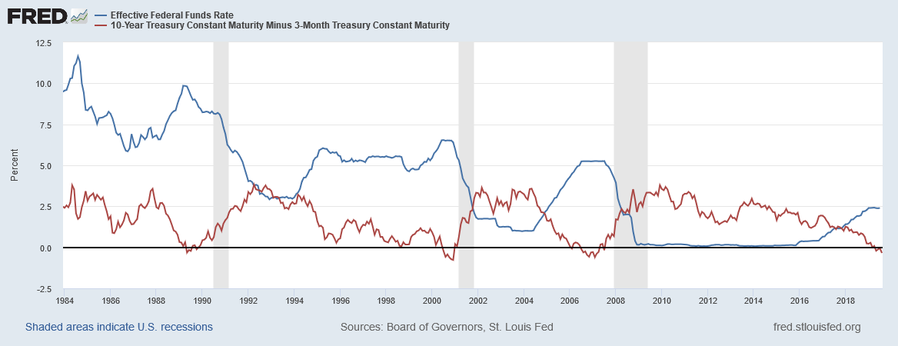

I believe gold will be one of the best performing assets of the next decade. Here is where I will lay out my case. I will attempt to show that the economy is in the later stages of an expansion, that traditional stores of wealth are heading toward zero or negative expected returns, and that traditional monetary policy will only increase the attractiveness of alternative stores of wealth.

# 1. Economic Context: We are in the later stages of the business cycle.

With the future being conditional on the present, the first step in determining the soundness of an investment thesis is to objectively identlfy where the economy and financial markets currently stand. To gauge where we are in the business cycle, we can look at three indicators with excellent track records: The unemployment rate, the output gap, and
the behavior of key interest rates (recessions shaded in gray).

First, the unemployment rate:

As we can see from above, it appears that maximum employment is somewhere between 3%-5%. We also notice a very strong cyclical pattern and that a strong uptick in the unemployment rate is a very good leading indicator of a recession. We are currently near the bottom of one such cyclical movement with unemployment at 3.7%.

Next, we can look at the output gap:

We see that recessions are typically avoided when there is room for the economy to grow. When the economy is producing at an unsustainably high rate, the odds of a slowdown increase dramatically. At present, we are producing more than is sustainable--indicating a heightened risk of a recession.

Finally, we can take a look at interest rate indicators: 

Typically, in the last stages of an economic expansion the yield curve dips negative and the federeal reserve stops raising or lowers the federal funds rate. At present, the 10 year minus 3 month treasury yield is negative, and the federal reserve has just cut rates for the first time since the great financial crisis. (.25 bp cut at July 2019 meeting)

So, given where we currently stand in the business cycle, it is fair to assume we will have a recession within the next 2-3 years.

# 2. Where do we go from here?: Trends and Intervention

Interest rates have been declining for decades:

Will continue until major stimulus - last time it was the war effort.
Global growth is slowing - a recession is imminent, question is timing. 
Monetary intervention: QE and cutting rates

# 3. Why Gold?

Correlation with real rates
Negative yields plus high stock market valuations/low growth could push people out of treasuries
Currency wars to spark growth